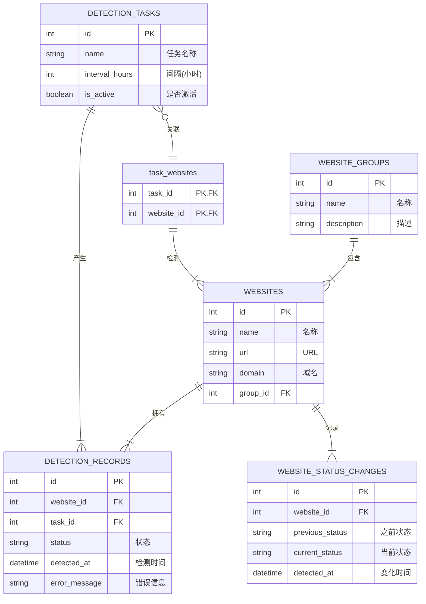

# 网址监控工具 - 项目技术文档

本文档为"网址监控工具"项目提供全面、深入的技术参考，旨在帮助开发者、运维人员和新加入的团队成员快速理解项目的设计、架构和实现细节。

## 1. 项目概述

### 1.1. 核心价值

在数字化时代，网站的可访问性是业务连续性的基石。特别是对于使用中文域名的网站，其解析和访问链路更为复杂，常常面临由网络策略、DNS污染或服务器配置不当引发的访问难题。

"网址监控工具"项目旨在解决这一核心痛点，它提供了一个自动化的、可靠的解决方案，能够：

*   **批量监控**：高效管理和检测大量的中文域名网站。
*   **精准判断**：准确区分网站的 **"标准解析"**、**"跳转解析"** 和 **"无法访问"** 三种核心状态。
*   **持续跟踪**：通过定时任务和状态变更记录，持续追踪网站健康状况，并在异常发生时及时预警。
*   **简化运维**：通过友好的Web界面，极大地简化了网站监控和数据管理的工作负担。

### 1.2. 功能矩阵

| 功能模块 | 具体功能 | 状态 | 备注 |
| :--- | :--- | :--- | :--- |
| **网站管理** | 批量导入网站 (Excel/CSV) | ✅ 已实现 | 支持"网址"或"domain"列名 |
| | 手动添加、编辑、删除网站 | ✅ 已实现 | |
| | 网站分组管理 | ✅ 已实现 | 支持自定义分组、颜色标记 |
| | 激活/禁用网站 | ✅ 已实现 | 可将网站临时移出检测范围 |
| **检测引擎** | 三种状态检测 | ✅ 已实现 | 标准解析、跳转解析、无法访问 |
| | 同步/异步并发检测 | ✅ 已实现 | 智能选择，提升大规模检测效率 |
| | 自定义检测配置 | ✅ 已实现 | 超时时间、重试次数、并发数 |
| | SSL证书信息检查 | ✅ 已实现 | 自动检查HTTPS网站证书有效性 |
| **任务调度** | 创建/编辑/删除检测任务 | ✅ 已实现 | |
| | 定时执行任务 | ✅ 已实现 | 基于APScheduler，间隔可配置 |
| | 立即手动触发任务 | ✅ 已实现 | |
| | 失败网站专项监控 | ✅ 已实现 | 自动对失败网站进行更频繁的监控 |
| **结果与分析** | 查看实时检测记录 | ✅ 已实现 | |
| | 历史结果查询与筛选 | ✅ 已实现 | |
| | 可访问性统计分析 | ✅ 已实现 | 以图表展示各状态网站占比 |
| | 网站状态变化追踪 | ✅ 已实现 | 记录每次状态从正常到异常的转变 |
| | 结果导出 (Excel) | ✅ 已实现 | |
| **系统管理** | 文件管理 | ✅ 已实现 | 管理上传和导出的文件 |
| | 邮件通知 (配置项) | 🚧 待配置 | 需在`config.py`中配置邮件服务 |
| | 系统性能监控 | ✅ 已实现 | 提供API获取CPU、内存等信息 |

### 1.3. 用户故事

*   **作为一名网站运维工程师**，我需要同时管理上百个客户的中文域名网站。过去，我只能手动逐个检查，耗时且容易出错。现在，我可以使用这个工具，每天早上自动收到一份所有网站可访问性的报告。当某个网站从"标准解析"变为"无法访问"时，我能第一时间收到邮件通知，从而在客户发现问题前就进行修复，极大地提升了我的工作效率和服务的可靠性。

*   **作为一名市场推广人员**，公司投放了大量使用中文域名的广告落地页。我需要确保这些页面始终能被用户正常访问，以保障营销活动的效果。通过这个工具，我可以轻松地将所有落地页地址导入系统进行7x24小时不间断监控，并通过统计图表直观地看到整体的可用性，确保广告预算没有因为技术问题而浪费。

## 2. 系统架构

### 2.1. 技术栈详情

| 领域 | 技术/库 | 版本 | 主要职责 |
| :--- | :--- | :--- | :--- |
| **后端框架** | Flask | 2.3.3 | 提供Web服务和API端点 |
| **数据库 ORM** | SQLAlchemy | >=2.0.30 | 数据库交互和模型定义 |
| **定时任务**| APScheduler | 3.10.4 | 执行周期性的网站检测任务 |
| **HTTP客户端**| Requests | 2.3.10 | 同步HTTP请求，用于网站检测 |
| | aiohttp | 3.9.1 | 异步HTTP请求，提升并发检测性能 |
| **Web服务器** | Werkzeug | (Flask依赖) | WSGI服务器 |
| **前端框架** | Vue.js | ^3.4.0 | 构建用户界面 |
| **前端路由** | Vue Router | ^4.2.0 | 管理单页应用的前端路由 |
| **UI组件库**| Element Plus | ^2.4.0 | 提供高质量的UI组件 |
| **HTTP客户端**| Axios | ^1.6.0 | 在前端发起对后端API的请求 |
| **构建工具** | Vite | ^6.0.0 | 前端开发服务器和生产构建工具 |
| **数据库** | SQLite | | 轻量级文件数据库，用于存储所有数据 |
| **文件处理** | Pandas | >=2.2.0 | 解析和生成Excel/CSV文件 |

### 2.2. 架构图

```mermaid
graph TD
    subgraph "用户浏览器"
        A[Vue.js 单页应用]
    end

    subgraph "Web 服务器 (Flask/Werkzeug)"
        B[API 路由 /api/*]
        C[核心业务服务]
        D[定时任务调度器 APScheduler]
    end

    subgraph "数据存储层"
        E[SQLite 数据库 (database.db)]
        F[文件系统 (uploads/downloads)]
    end

    subgraph "外部依赖"
        G[目标网站]
        H[SMTP 邮件服务器]
    end

    A -- "HTTP/HTTPS (Axios)" --> B
    B -- "调用" --> C
    C -- "读写数据 (SQLAlchemy)" --> E
    C -- "读写文件" --> F
    C -- "HTTP检测 (Requests/aiohttp)" --> G
    C -- "发送邮件" --> H
    D -- "定时触发" --> C
```

### 2.3. 代码目录导览

```
网址监控/
├── backend/                 # ✅ 后端核心代码
│   ├── app.py              # ---- Flask应用工厂，项目入口
│   ├── config.py           # ---- 配置文件，定义应用参数
│   ├── database.py         # ---- 数据库初始化和会话管理
│   ├── models.py           # ---- SQLAlchemy数据模型定义
│   ├── api/                # ---- API蓝图，定义所有HTTP接口
│   │   ├── websites.py     # ------ 网站增删改查API
│   │   ├── tasks.py        # ------ 检测任务管理API
│   │   └── ...             # ------ 其他资源API
│   └── services/           # ---- 核心业务逻辑服务
│       ├── website_detector.py # -- 网站检测引擎核心
│       ├── scheduler_service.py# -- 定时任务调度服务
│       ├── file_parser.py  # ------ 文件导入解析服务
│       └── ...             # ------ 其他业务服务
├── frontend/               # ✅ 前端核心代码
│   ├── src/
│   │   ├── App.vue         # ------ 根组件
│   │   ├── main.js         # ------ 入口文件，初始化Vue实例
│   │   ├── router/         # ------ Vue Router路由配置
│   │   ├── utils/          # ------ 工具函数
│   │   │   └── api.js      # -------- 封装所有对后端API的请求
│   │   └── views/          # ------ 页面级组件
│   └── package.json        # ---- 前端依赖和脚本配置
├── database/               # 存放SQLite数据库文件
├── logs/                   # 存放应用日志文件
├── requirements.txt        # Python依赖清单
└── PROJECT_DOCUMENTATION.md# 本技术文档
``` 

## 3. 数据库设计

### 3.1. 实体关系图 (ERD)



### 3.2. 数据字典

#### 3.2.1. `websites` (网站信息表)

存储所有需要被监控的网站的基本信息。

| 字段名 | 数据类型 | 注释 | 示例 |
| :--- | :--- | :--- | :--- |
| **id** (PK)| INTEGER | 网站唯一标识 | `101` |
| name | VARCHAR(255)| 网站的业务名称 | `公司官网` |
| url | TEXT | 经过标准化处理后的访问URL| `http://中国互联网络信息中心.网址/` |
| domain | VARCHAR(255)| 从URL中提取的中文域名 | `中国互联网络信息中心.网址` |
| original_url | TEXT | 用户导入时的原始网址 | `www.中国互联网络信息中心.网址` |
| group_id (FK)| INTEGER | 关联到 `website_groups.id` | `1` |
| is_active | BOOLEAN | 是否激活（`1`=是, `0`=否）| `1` |
| created_at | DATETIME | 记录创建时间 | `2023-10-26 10:00:00` |

#### 3.2.2. `detection_tasks` (检测任务表)

定义了检测任务的配置，如频率、名称等。一个任务可以关联多个网站。

| 字段名 | 数据类型 | 注释 | 示例 |
| :--- | :--- | :--- | :--- |
| **id** (PK)| INTEGER | 任务唯一标识 | `1` |
| name | VARCHAR(255)| 任务的业务名称 | `核心业务网站监控` |
| interval_hours | INTEGER | 检测频率（单位：小时）| `2` |
| max_concurrent | INTEGER | 最大并发检测数 | `10` |
| timeout_seconds| INTEGER | 单个网站检测超时时间（秒）| `30` |
| is_active | BOOLEAN | 是否激活此定时任务 | `1` |
| last_run_at| DATETIME | 上次运行时间 | `2023-10-26 12:00:00` |
| next_run_at| DATETIME | 计划的下次运行时间 | `2023-10-26 14:00:00` |

#### 3.2.3. `detection_records` (检测记录表)

存储每一次对网站进行检测的结果，是系统中最核心的数据表之一。

| 字段名 | 数据类型 | 注释 | 示例 |
| :--- | :--- | :--- | :--- |
| **id** (PK)| INTEGER | 记录唯一标识 | `5001` |
| website_id(FK)| INTEGER | 关联到 `websites.id` | `101` |
| task_id (FK)| INTEGER | 关联到 `detection_tasks.id` | `1` |
| status | VARCHAR(20) | 检测状态: `standard`, `redirect`, `failed` | `standard` |
| final_url | TEXT | 最终访问的URL（处理重定向后）| `http://cnnic.cn/` |
| response_time| FLOAT | 网站响应时间（秒） | `0.54` |
| http_status_code|INTEGER| HTTP响应状态码 | `200` |
| error_message | TEXT | 当`status`为`failed`时的错误信息| `Connection timed out` |
| detected_at | DATETIME | 检测执行时间 | `2023-10-26 12:00:05` |
``` 

## 4. 核心流程深度解析

### 4.1. 网站可访问性检测流程

网站检测是整个系统的核心。`WebsiteDetector` 服务负责执行此流程，其详细工作步骤如下：

```mermaid
graph TD
    subgraph "输入"
        A[URL列表]
    end

    subgraph "检测引擎: WebsiteDetector"
        B{选择模式}
        C[同步检测<br>(ThreadPoolExecutor)]
        D[异步检测<br>(aiohttp)]
        E[初始化: 创建Session, 设置重试策略]
        F[循环处理单个URL]
        G[标准化URL]
        H{URL是否为HTTPS?}
        I[检查SSL证书]
        J[执行HTTP GET/HEAD请求]
        K{请求是否成功?}
        L[分析响应: 状态码, URL, 内容]
        M{是否为中文域名?}
        N[判断为 "标准解析"]
        O[判断为 "跳转解析"]
        P[记录错误信息<br>判断为 "无法访问"]
    end

    subgraph "输出"
        Q[DetectionResult列表]
    end

    A --> B
    B -- "少量URL或异步组件不可用" --> C
    B -- "大量URL且异步组件可用" --> D
    C --> E
    D --> E
    E --> F
    F --> G
    G --> H
    H -- "是" --> I
    H -- "否" --> J
    I --> J
    J --> K
    K -- "成功" --> L
    K -- "失败(超时/DNS错误等)" --> P
    L --> M
    M -- "是" --> N
    M -- "否" --> O
    N --> Q
    O --> Q
    P --> Q
```

**流程详解:**

1.  **模式选择 (`detect_batch_websites`)**:
    *   当接收到一批URL时，系统会根据URL的数量和异步组件（`aiohttp`）的可用性，智能选择更高性能的 **异步模式** 或更稳定的 **同步模式**。

2.  **会话初始化 (`_create_session`)**:
    *   为每个检测任务创建一个 `requests.Session` 对象。
    *   配置一个强大的 **重试策略** (`Retry`)，当遇到网络抖动或服务器临时错误（如 `502`, `503`）时，会自动进行最多2次的重试，增强了检测的可靠性。
    *   设置标准的浏览器 `User-Agent`，以模拟真实用户访问。

3.  **URL标准化 (`normalize_url`)**:
    *   对输入的URL进行预处理，例如自动添加 `http://` 前缀，确保URL格式的统一。

4.  **SSL证书检查 (`_check_ssl_certificate`)**:
    *   如果URL是 `https://` 协议，系统会额外尝试建立SSL连接，检查证书的有效性、颁发者以及是否即将过期。此步骤独立于主HTTP请求，能更精确地定位HTTPS相关问题。

5.  **HTTP请求 (`_make_request`)**:
    *   使用配置好的会话和超时时间，向目标URL发起 `GET` 请求。
    *   通过 `try...except` 块捕捉所有潜在的异常，如 `ConnectionError`, `Timeout`, `TooManyRedirects` 等，并将这些异常转化为结构化的错误信息。

6.  **响应分析 (`_analyze_response`)**:
    *   **如果请求成功 (HTTP状态码 2xx)**：
        *   获取最终的URL（`response.url`）。
        *   提取原始URL的域名（如 `a.com`）和最终URL的域名（如 `b.com`）。
        *   **状态判定**:
            *   如果最终URL的域名 **仍然是中文域名**，则状态为 **`standard` (标准解析)**。
            *   如果最终URL的域名 **变成了非中文域名**，则状态为 **`redirect` (跳转解析)**。
    *   **如果请求失败**：
        *   状态被直接标记为 **`failed` (无法访问)**，并详细记录下捕获到的异常信息（如"连接超时"）。

7.  **结果封装**:
    *   所有检测信息，包括状态、响应时间、最终URL、错误信息等，都被封装在 `DetectionResult` 对象中，最终返回一个包含所有网站检测结果的列表。

### 4.2. 定时任务生命周期

系统使用 `APScheduler` 库来管理定时任务，其生命周期由 `SchedulerService` 控制。

1.  **初始化**:
    *   后端应用启动时，`SchedulerService` 会被实例化。
    *   它会从数据库中加载所有 `is_active=True` 的 `DetectionTask`。

2.  **任务添加**:
    *   对于每个激活的任务，使用 `scheduler.add_job()` 方法将其添加到调度器中。
    *   任务的触发器设置为 `IntervalTrigger`，执行间隔由 `task.interval_hours` 定义。
    *   要执行的函数是 `detection_service.run_task`，并将任务ID作为参数传入。

3.  **任务执行**:
    *   当预设的间隔时间到达，`APScheduler` 会在后台线程中调用 `detection_service.run_task(task_id)`。
    *   `run_task` 方法会：
        1.  从数据库中查找该任务关联的所有网站。
        2.  调用 `WebsiteDetector` 对这些网站进行批量检测。
        3.  将返回的 `DetectionResult` 列表保存到 `detection_records` 表中。
        4.  更新 `detection_tasks` 表中的 `last_run_at` 和 `next_run_at` 时间戳。

4.  **任务管理**:
    *   当用户通过API **停止**、**更新** 或 **删除** 一个任务时，`SchedulerService` 会调用 `scheduler.remove_job()` 或 `scheduler.modify_job()` 来动态地管理调度器中的任务。

### 4.3. 文件处理流程

1.  **文件上传 (`/api/files/upload`)**:
    *   用户通过前端界面选择一个 Excel (`.xlsx`) 或 CSV (`.csv`) 文件。
    *   前端将文件以 `multipart/form-data` 格式提交到后端。
    *   后端 `files.py` 中的API接收文件，并将其保存在服务器的 `uploads/` 目录下，文件名带有时间戳以防冲突。
    *   调用 `FileParserService` 的 `parse_and_save_websites` 方法。

2.  **文件解析 (`FileParserService`)**:
    *   使用 `pandas` 库的 `read_excel` 或 `read_csv` 方法读取文件内容。
    *   自动查找名为"网址"或"domain"的列。
    *   遍历该列的每一行，对每个URL进行清洗和标准化。
    *   将解析出的网站信息批量存入 `websites` 数据库表中。

3.  **结果导出 (`/api/results/export`)**:
    *   用户在前端点击"导出"按钮。
    *   后端 `results.py` 中的API接收请求，并调用 `ExportService`。
    *   `ExportService` 从数据库中查询最新的检测结果。
    *   使用 `pandas` 将查询结果构建成一个 DataFrame。
    *   调用 DataFrame 的 `to_excel` 方法，生成一个Excel文件，并保存在 `downloads/` 目录下。
    *   API返回生成的文件名。前端收到后，通过 `/api/files/download/<filename>` 接口触发浏览器下载。

## 5. API 端点权威指南

### 5.1. 通用设计

*   **基地址**: 所有API的基地址为 `/api`。
*   **认证**: 当前版本为内部使用，未设置API认证。
*   **响应结构**: 所有成功的API请求都返回统一的JSON结构：
    ```json
    {
      "code": 200,
      "message": "操作成功",
      "data": { ... } // 或 [ ... ]
    }
    ```
*   **错误结构**: 所有失败的API请求（客户端或服务器错误）也返回统一的JSON结构：
    ```json
    {
      "code": 500,
      "message": "服务器内部错误",
      "data": null
    }
    ```

### 5.2. 接口详述

#### **Website (网站资源)**

*   **`GET /api/websites/`**: 获取网站列表（支持分页和筛选）
    *   **查询参数**:
        *   `page` (int, optional): 页码，默认 `1`。
        *   `per_page` (int, optional): 每页数量，默认 `10`。
        *   `group_id` (int, optional): 按分组ID筛选。
        *   `query` (string, optional): 按网站名称或域名模糊搜索。
    *   **成功响应 (200)**:
        ```json
        {
          "code": 200, "message": "获取成功",
          "data": {
            "items": [
              { "id": 1, "name": "网站A", "domain": "a.网址", ... }
            ],
            "total": 1, "page": 1, "pages": 1
          }
        }
        ```

*   **`POST /api/websites/import`**: 从文件导入网站
    *   **请求体**: `multipart/form-data`，包含一个名为 `file` 的文件字段。
    *   **成功响应 (200)**:
        ```json
        {
          "code": 200, "message": "成功导入 50 个网站",
          "data": { "success_count": 50, "failed_count": 0 }
        }
        ```

#### **Task (任务资源)**

*   **`GET /api/tasks/`**: 获取检测任务列表
    *   **成功响应 (200)**:
        ```json
        {
          "code": 200, "message": "获取成功",
          "data": [
            { "id": 1, "name": "核心业务监控", "interval_hours": 2, "is_active": true, ... }
          ]
        }
        ```

*   **`POST /api/tasks/`**: 创建新检测任务
    *   **请求体 (JSON)**:
        ```json
        {
          "name": "新任务",
          "interval_hours": 8,
          "website_ids": [101, 102]
        }
        ```
    *   **成功响应 (200)**:
        ```json
        {
          "code": 200, "message": "任务创建成功",
          "data": { "id": 2, "name": "新任务", ... }
        }
        ```

*   **`POST /api/tasks/{id}/start`**: 立即执行一次任务
    *   **路径参数**: `id` (int, required): 任务ID。
    *   **成功响应 (200)**:
        ```json
        {
          "code": 200,
          "message": "任务 '核心业务监控' 已开始执行",
          "data": null
        }
        ```

*   **`POST /api/tasks/{id}/schedule`**: 启动定时调度
*   **`POST /api/tasks/{id}/stop`**: 停止定时调度

#### **Result (结果资源)**

*   **`GET /api/results/`**: 获取检测记录列表（支持分页和筛选）
    *   **查询参数**:
        *   `page` (int, optional): 页码。
        *   `per_page` (int, optional): 每页数量。
        *   `status` (string, optional): 按状态筛选 (`standard`, `redirect`, `failed`)。
        *   `website_id` (int, optional): 按网站ID筛选。
    *   **成功响应 (200)**:
        ```json
        {
          "code": 200, "message": "获取成功",
          "data": {
            "items": [
              { "id": 5001, "website_name": "网站A", "status": "standard", ... }
            ],
            "total": 1, "page": 1, "pages": 1
          }
        }
        ```

*   **`GET /api/results/statistics`**: 获取统计数据
    *   **成功响应 (200)**:
        ```json
        {
          "code": 200, "message": "获取成功",
          "data": {
            "total_websites": 100,
            "status_distribution": {
              "standard": 80,
              "redirect": 15,
              "failed": 5
            }
          }
        }
        ```

*   **`POST /api/results/export`**: 导出检测结果为Excel文件
    *   **成功响应 (200)**:
        ```json
        {
          "code": 200, "message": "导出任务已创建",
          "data": { "filename": "网址检测结果_20231026153000.xlsx" }
        }
        ```